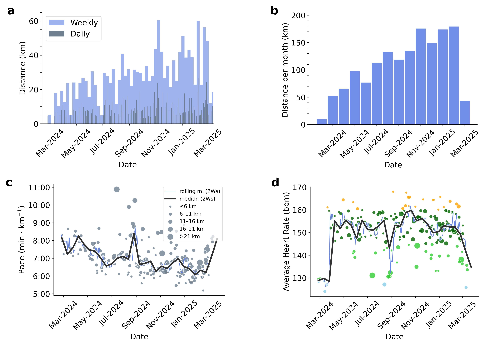
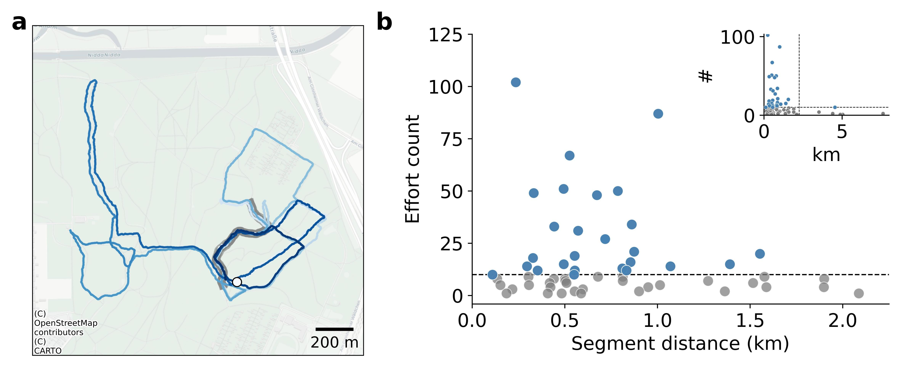
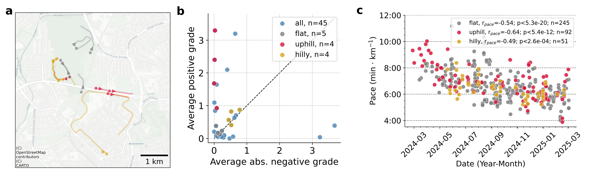
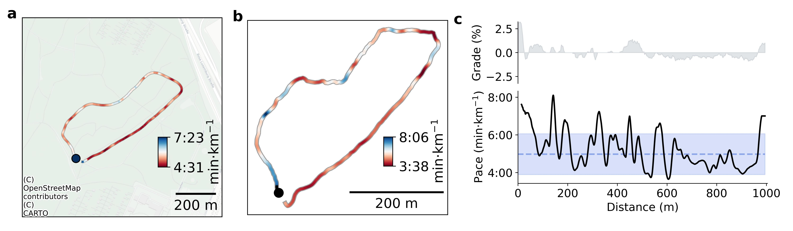

# strava-running

Analyzing my strava running data from overviews to details

## Distance, Pace and Heart Rate Progression

This visualization shows the progression of running distances, pace and heart rate over time, providing insights into the development of training volume (endurance) as well as performance and cardiovascular fitness improvements.

## Strava Segments

Segments represent a physical stretch of road or trail that is spatially delineated in distance. Strava segments offer runners a feature to compare their own efforts over time and compete with other runners that use strava.

Many segments may be covered over the course of a single run. Figure a, shows a run with segment passages highlighted in gray. Figure b shows the number of times I attempted one of my many starred segments as well as the segments distance.

## Tracking progress using segments

Unlike a single run, a segment is typically between 100 meters and 2 km long. Also they can be classified into certain types i.e. flat, hilly, uphill or downhill. Figure a illustrates several of my favorite segments with the color code corresponding to the classification of that segment based on the average positive- versus negative grade profile. This is clarified in Figure b. Figure c shows pace improvments using the pooled efforts of the selected type of segments.

## A single segment, many efforts

One of my favorite segments is a 1km long trail called "Wäldchen 1k" in the heart of Niddapark, Frankfurt am Main, Germany. Calculating the average pace of my top-ten fastest efforts I can visualize the systematic variations of pace along the segment. I will use this information for future efforts to attempt not slowing down around particular stretches. Figure b shows my fastest effort, achieved recently. While a and b show pace along the physical path of the segment, Figure c shows pace versus distance along the segment together with the grade profile for further insights.

